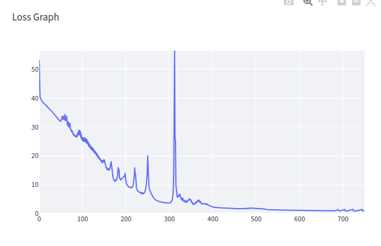

[](https://classroom.github.com/online_ide?assignment_repo_id=15551800&assignment_repo_type=AssignmentRepo)
# MiniTorch Module 1


* Docs: https://minitorch.github.io/

* Overview: https://minitorch.github.io/module1/module1/

This assignment requires the following files from the previous assignments. You can get these by running

```bash
python sync_previous_module.py previous-module-dir current-module-dir
```

The files that will be synced are:

        minitorch/operators.py minitorch/module.py tests/test_module.py tests/test_operators.py project/run_manual.py

## Trained Models
### Simple
Learning Rate: 0.5 \
Epochs: 750 \
Hidden Layer Size: 4 \


### Diag
Learning Rate: 0.5 \
Epochs: 500 \
Hidden Layer Size: 2 \


### Split
Learning Rate: 0.5 \
Epochs: 750 \
Hidden Layer Size: 5 \


### Xor
Learning Rate: 0.5 \
Epochs: 750 \
Hidden Layer Size: 5 \



### Circle
Learning Rate: 0.1 \
Epochs: 1000 \
Hidden Layer Size: 10 \

